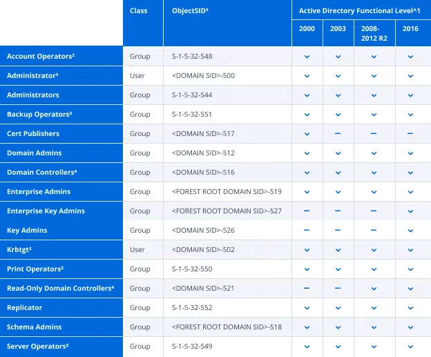
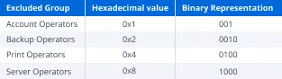

# AdminCount

All AD user, group and computer objects have this attribute `AdminCount`. By default, it has the value “**<NOT SET>**”. But when the object is added (directly or transitively) to certain protected groups, the value is updated to “**1**”. As a result, checking this attribute seems like a good method for identifying objects with administrative privileges.

The following table lists Active Directory’s default protected object sets, including the groups that **may induce an update of the AdminCount attribute** on its members:

“may induce an update of the AdminCount attribute” because there are a number of variables that influence membership in the protected object set. Let’s start with the superscript annotations:

1. Protected object set varies across the different Active Directory functional levels.
2. The default protected object set includes four groups that can be manually excluded from protection: **Account Operators, Backup Operators, Print Operators and Server**. The mechanism that controls this behavior is located in the dsHeuristics attribute of the `CN=Directory Service,CN=Windows NT,CN=Services,<FOREST ROOT DN>` object. The value of this attribute is a Unicode string in which each character represents a single forest-wide configuration setting. The relevant character to this discussion is the 16th character, which, if it exists, represents the “dwAdminSDExMask”. Its value is presented as a hexadecimal character, but it’s a little easier to understand the behavior if we look at its binary equivalent. Each bit in the binary representation signifies a specific group. If the bit associated with any specific group is not 0, that group will be excluded from the protected object set.
    
    
    
3. The default protected object set includes two user objects: **Administrator** and **krbtgt**. These objects are explicitly protected, but they won’t induce AdminCount updates on other objects because you can’t make a user, group or computer a member of a user object.
4. The **default protected object set includes two groups** that do not confer their protected status on their members: **Domain Controllers** and **Read-Only Domain Controllers**. While the `DCPROMO` command will add the associated computer object to the appropriate domain controller group when promoting a host as a domain controller, it won’t result in the object being added to the protected object set.

# **AdminSDHolder and SDPROP**

Now let’s talk about the mechanism that controls the `AdminCount` attribute’s behavior.

Each AD object has a **security descriptor** that contains information about the object’s ownership, its primary group, the users and groups that are allowed or denied permission to access the object (**the Discretionary Access Control List [DACL]**), and the auditable events that will generate a record in the security event log (**the System Access Control List [SACL]**). They also contain control bits that can modify the security descriptor’s behavior.

To help secure objects known to possess elevated administrative privileges, Active Directory applies a strict security descriptor called the **Authoritative Security Descriptor** to every member of a domain’s protected object set. The Authoritative Security Descriptor is defined in the **AdminSDHolder** object located in the System container of every [Active Directory domain](https://blog.netwrix.com/2017/01/31/active-directory-domain/)’s default naming context (e.g., CN=AdminSDHolder,CN=System,<DOMAIN DN>).

<aside>
ℹ️

The access control list (ACL) of the AdminSDHolder object is used as a template to copy permissions to all protected groups in Active Directory and their members. 

</aside>

# **The Security Descriptor Propagator (SDPROP) Task**

Active Directory addresses these needs with a task called the **Security Descriptor Propagator (SDPROP)**. This task is executed by the Local Security Authority Subsystem Service on domain controllers that own the PDC Emulator FSMO role every 60 minutes, by default. This period serves to limit the length of time that a modification of a highly privileged object’s security descriptor, whether malicious or accidental, might persist, while acknowledging the relatively computationally expensive nature of SDPROP execution.

When SDPROP is executed, it identifies the domain’s default protected object set and then recursively moves through the membership tree of each of those objects to identify the complete membership of the protected object set. SDPROP compares the security descriptor of each object to the Authoritative Security Descriptor; if they do not match, the object’s security descriptor is replaced with the Authoritative Security Descriptor and the value of the object’s AdminCount attribute is set to 1.

## **SDPROP executes on a schedule.**